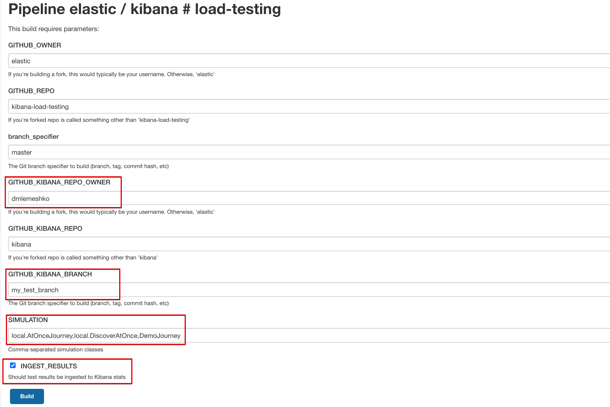
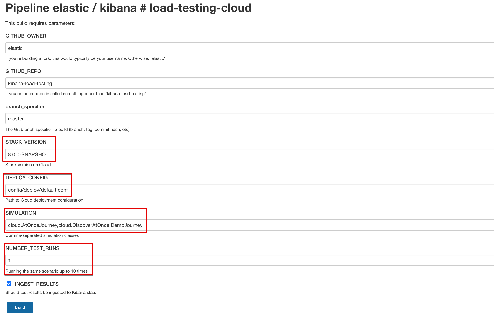

# Kibana performance testing on CI

## Overview
At the moment we got 2 ways to do performance testing: branch testing and cloud testing
## Branch testing
Use it to test your feature branch and compare results with master.

Start a new run:
- go to [load-testing](https://kibana-ci.elastic.co/view/Kibana/job/elastic+kibana+load-testing/) job
- click 'Build with Parameters'
- enter your github username & branch name, simulation classes, uncheck 'INGEST RESULTS' if you don't need it in Kibana stats  
- click 'Build'

Process:
- build Kibana from branch source code
- start Kibana and ES using FTR
- start Metricbeat monitoring
- run performance simulations
- ingest results and monitoring stats to Kibana stats

## Cloud testing
Use it to test Kibana on Cloud Staging as a part of new deployment.

Start a new run:
- go to [load-testing-cloud](https://kibana-ci.elastic.co/view/Kibana/job/elastic+kibana+load-testing-cloud/) job
- click 'Build with Parameters'
- enter your stack version, simulation classes, uncheck 'INGEST RESULTS' if you don't need it in Kibana stats
- click 'Build'
  
   
You can use existing deployment config files to define your desired stack setup or create add a new one to 
`kibana-load-testing/config/deployment/` path and specify it in 'DEPLOY_CONFIG' input field

Process:
- create a new deployment
- run performance simulations
- delete deployment  
- ingest results and to Kibana stats

## Scheduled pipelines
- branch testing
    - when: daily
    - what: 7.x, master
- cloud testing
    - when: daily
    - what: latest 7.x and 8.0 snapshots
  
## Test results

Open finished job run and click 'Google Cloud Storage Upload Report'
You will find archive with html reports

Go to [Kibana-Stats](https://kibana-stats.elastic.dev/) cluster and open 'Load Testing' space to access test results.