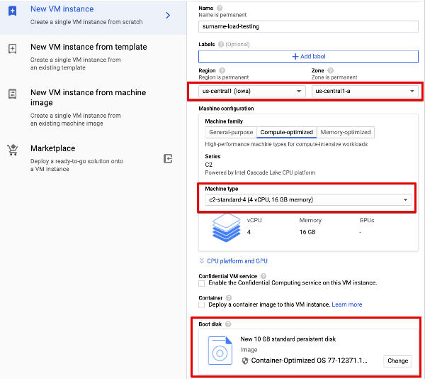

# Running project on GCP VM

While running tests from a local machine against cloud instance results can
be not accurate because of unstable internet connection or extra latency.

In order to improve results accuracy it is better to run tests in the same data center
(region), where cluster is deployed.

## Create new VM

Create a new CPU-optimized VM with any Container Optimized OS in the same region where
Elastic Stack will be deployed:



## Upload project to VM

- Install [gcloud cli](https://cloud.google.com/sdk/docs/install)

- Connect to VM:
```
gcloud beta compute ssh --zone "us-central1-a" "surname-load-testing" --project "<project-id>"
```

- After connecting to VM create a folder to store project:
```
mkdir test
```

- In other terminal window gzip project sources and transfer archive to VM
```
tar -xzf KibanaLoadTesting.tar.gz .
sudo gcloud compute scp KibanaLoadTesting.tar.gz <user>@surname-load-testing:/home/<user>/test  --zone "us-central1-a" --project "project-id"
```

## Running tests

- Connect to VM and unzip archive
```
cd test
tar -xzf KibanaLoadTesting.tar.gz
```

- Start docker image with JDK+Maven and mount `test` directory on the host machine into a container:
```
sudo docker run -it -v "$(pwd)":/local/git --name java-maven --rm jamesdbloom/docker-java8-maven
```

- `test` folder with project should be available in container, start tests as locally
```
export API_KEY=<Your API Key>
export cloudDeploy=7.11.0-SNAPSHOT
mvn clean -Dmaven.test.failure.ignore=true compile
mvn gatling:test -Dgatling.simulationClass=org.kibanaLoadTest.simulation.DemoJourney
```

- Stop container on tests finish, results should be available in `/home/<user>/test/target/gatling/`
 
## Copy results to local machine
- Gzip results
```
sudo tar -czvf results.tar.gz target/gatling/demojourney-20201118160915491/
``` 
- Download archive from local machine
```
sudo gcloud compute scp  <user>@surname-load-testing:/home/<user>/test/results.tar.gz . --zone=us-central1-a
```


